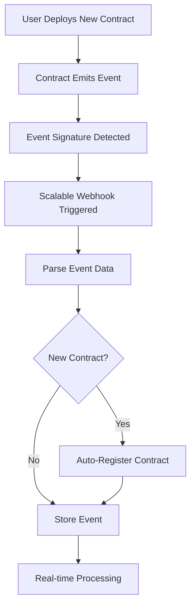

# 🚀 Scalable Event Monitoring Guide

## Overview

This guide explains how to monitor smart contract events at massive scale using **event signature monitoring** instead of individual contract addresses.

## 🔄 Monitoring Approaches Comparison

### ❌ Old Approach: Address-Based Monitoring
```
Problem: Monitor 1000s of individual contract addresses
- Webhook 1: [Contract1, Contract2, ..., Contract1000] ❌ LIMIT REACHED
- Webhook 2: [Contract1001, Contract1002, ..., Contract2000] ❌ LIMIT REACHED  
- Webhook N: [More contracts...] ❌ MANAGEMENT NIGHTMARE
```

**Issues:**
- ⚠️ **Address Limits**: Alchemy webhooks limited to ~1000 addresses
- 🐌 **Poor Performance**: Multiple webhooks, massive payloads
- 🔧 **Management Overhead**: Constant webhook updates for new contracts
- 💸 **High Costs**: Multiple webhook subscriptions

### ✅ New Approach: Event Signature Monitoring
```
Solution: Monitor by EVENT SIGNATURES across ALL contracts
- Single Webhook: Monitor signature 0x345a1e... (PositionOpened) ✅ UNLIMITED
```

**Benefits:**
- ♾️ **Unlimited Scale**: Monitor millions of contracts with one webhook
- ⚡ **Real-time**: Immediate detection of events from ANY contract
- 🤖 **Auto-Discovery**: New contracts automatically monitored
- 📉 **Reduced Costs**: Single webhook subscription

## 🎯 How Event Signature Monitoring Works

### 1. **Event Signatures**
Every Solidity event has a unique signature (keccak256 hash):

```solidity
// Event definition
event PositionOpened(address indexed user, uint256 indexed positionId, bool isLong, uint256 size, uint256 price, uint256 leverage, uint256 fee);

// Signature calculation
keccak256("PositionOpened(address,uint256,bool,uint256,uint256,uint256,uint256)")
// = 0x345a1e15bff227bfd5051975d95c864c45cf9fe79def6f9ce1c1525b0e831226
```

### 2. **Signature-Based Webhook**
Instead of monitoring specific addresses, monitor the signature:

```graphql
{
  block {
    logs(filter: {
      topics: ["0x345a1e15bff227bfd5051975d95c864c45cf9fe79def6f9ce1c1525b0e831226"]
    }) {
      account { address }
      topics
      data
      transaction { hash blockNumber }
    }
  }
}
```

### 3. **Automatic Contract Detection**
When an event is detected:
1. ✅ **Parse Event**: Extract event data
2. 🔍 **Check Contract**: Is this a new contract?
3. 📝 **Register**: Add new contract to database
4. 💾 **Store Event**: Save event with all details

## 📊 Monitored Event Signatures

The system monitors these critical events:

| Event | Signature | Description |
|-------|-----------|-------------|
| `PositionOpened` | `0x345a1e...` | New trading positions |
| `PositionClosed` | `0x035509...` | Position closures |
| `PositionLiquidated` | `0xeb125f...` | Liquidation events |
| `MarketCreated` | `0x47ab76...` | New market deployments |
| `CollateralDeposited` | `0xd7243f...` | Collateral deposits |
| `TradingFeeCollected` | `0x4b85f1...` | Fee collections |

## 🏗️ Architecture



## 🚀 Implementation

### 1. **Migration Script**
Migrate from address-based to signature-based monitoring:

```bash
node scripts/migrate-to-scalable-monitoring.ts
```

### 2. **Core Components**

#### **ScalableEventMonitor**
```typescript
// Initialize scalable monitoring
const monitor = await getScalableEventMonitor();

// Process webhook events
const result = await monitor.processWebhookEvent(webhookData);
// Returns: { processed: 50, newContracts: 5, events: [...] }
```

#### **Webhook Endpoint**
```typescript
// New scalable endpoint
POST /api/webhooks/alchemy/scalable

// Handles events from ALL contracts automatically
```

### 3. **Event Processing Flow**

```typescript
// 1. Webhook receives event with signature
const eventSignature = log.topics[0]; // "0x345a1e..."

// 2. Identify event type
const eventType = getEventTypeFromSignature(eventSignature); // "PositionOpened"

// 3. Check if contract is new
const isNew = await checkAndRegisterNewContract(contractAddress);

// 4. Parse and store event
const event = await parseEventBySignature(log, eventType);
await database.storeEvent(event);
```

## 📈 Scale Testing

### **Current System Limits**
- ✅ 15 contracts: Working
- ⚠️ 100 contracts: Manageable
- ❌ 1,000+ contracts: Webhook limits
- ❌ 10,000+ contracts: Impossible

### **Scalable System**
- ✅ 15 contracts: Working
- ✅ 1,000 contracts: Working
- ✅ 10,000 contracts: Working
- ✅ 100,000+ contracts: Working ♾️

## 🧪 Testing the System

### 1. **Deploy the Scalable System**
```bash
# Migrate to scalable monitoring
node scripts/migrate-to-scalable-monitoring.ts
```

### 2. **Test with Existing Contracts**
```bash
# Check health
curl https://your-app.com/api/webhooks/alchemy/scalable

# Should return: "Scalable event monitoring is operational"
```

### 3. **Deploy New Markets**
1. Use your factory to deploy new markets
2. Watch logs for: `🆕 Registered new vAMM contract: 0x...`
3. Verify events are being captured automatically

### 4. **Simulate High Volume**
```bash
# Deploy 100 new markets rapidly
# Watch the system handle them automatically
# No webhook updates needed! 🎉
```

## 🔧 Configuration

### **Environment Variables**
```bash
# Required for scalable monitoring
ALCHEMY_API_KEY=your-alchemy-api-key
ALCHEMY_WEBHOOK_AUTH_TOKEN=your-webhook-auth-token
APP_URL=https://your-app.com

# Optional: Webhook security
ALCHEMY_WEBHOOK_SIGNING_KEY=your-signing-key
```

### **Custom Configuration**
```typescript
const monitor = new ScalableEventMonitor({
  factoryAddress: "0x70Cbc2F399A9E8d1fD4905dBA82b9C7653dfFc74",
  network: 'polygon',
  webhookUrl: `${APP_URL}/api/webhooks/alchemy/scalable`,
  monitoredEvents: [
    'PositionOpened',
    'PositionClosed',
    'MarketCreated',
    // Add more events as needed
  ]
});
```

## 🚦 Monitoring & Observability

### **Health Checks**
```bash
# Check scalable system status
GET /api/webhooks/alchemy/scalable

# Response includes:
# - Webhook status
# - Monitored events
# - System capabilities
```

### **Metrics**
```typescript
// Get processing metrics
const result = await monitor.processWebhookEvent(data);

console.log(`Processed: ${result.processed} events`);
console.log(`New contracts: ${result.newContracts}`);
console.log(`Total events: ${result.events.length}`);
```

### **Logging**
```
📨 Received Scalable Event Webhook...
🎯 Processing PositionOpened event from 0x1234...
🆕 Registered new vAMM contract: 0x1234...
✅ Processed 25 events, detected 3 new contracts
```

## 🎯 Migration Benefits Summary

| Aspect | Old System | New System |
|--------|------------|------------|
| **Contract Limit** | ~1,000 | ♾️ Unlimited |
| **Webhooks Needed** | Multiple | Single |
| **New Contract Setup** | Manual | Automatic |
| **Performance** | Degraded at scale | Consistent |
| **Management** | Complex | Simple |
| **Cost** | High (multiple webhooks) | Low (single webhook) |

## 🎉 Success Metrics

After migration, you'll achieve:

- **♾️ Unlimited Scaling**: Deploy 10,000+ contracts without limits
- **🤖 Zero Configuration**: New contracts monitored automatically  
- **⚡ Real-time Processing**: Events captured immediately
- **📉 Reduced Costs**: Single webhook vs. multiple
- **🔧 Simplified Management**: One system to rule them all

## 💡 Next Steps

1. **Run Migration**: `node scripts/migrate-to-scalable-monitoring.ts`
2. **Test System**: Deploy new markets and verify auto-detection
3. **Monitor Logs**: Watch the scalable webhook endpoint
4. **Scale Up**: Deploy hundreds/thousands of contracts
5. **Celebrate**: You now have unlimited scaling! 🚀

Your platform is now ready to scale to millions of contracts! 🎊 